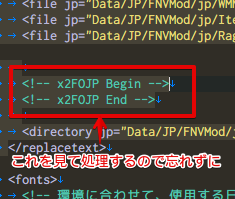

# x2FOJP

## Overview

xTranslatorから出力したxmlを元にfojp向けに変換をサポートするツールです

## How to use

### Settings

- 最初にツールを立ち上げたら、まずは設定を行って下さい

- 例として自分の環境で設定した場合はこんな感じ

- 変換元と変換先の中身はこんな感じ

---

**fojp.xmlに反映する機能について**

- 専用のタグ`<!-- x2FOJP Begin -->`と`<!-- x2FOJP End -->`を記述してください
  

---

**翻訳テキスト・読み込みパスについて** 

- fojp.xmlに反映する際に付加されるパスです
  

### Convert

- チェックを付けたファイルが変換処理の対象となります
  

**変換について** 
- xmlからtxtの変換は更新日付を見て処理が行われます
- 変換の必要が無い場合スキップされ、ステータスバーにスキップされた数が表示されます

## Notice
- アイコンは [ICOOON MONO](https://icooon-mono.com
) 様のものを使用しています  
再配布は禁止事項に当たるためリポジトリで管理していません  
ビルドする場合は上記サイトから取得するか代替のアイコンをご用意ください

## Licence

[MIT](https://github.com/hananoki/x2FOJP/blob/master/LICENSE.md)